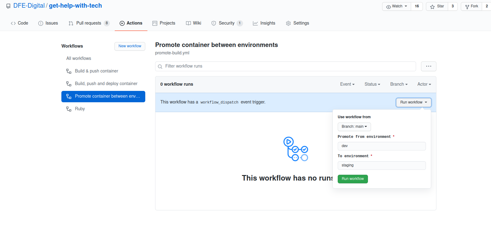

# Get Help With Tech

An app to host content and forms for the "Get Help With Tech" COVID-19 response initiative.

## Prerequisites

### For running the app:

- [Ruby](.ruby-version)
- PostgreSQL
- NodeJS >= 12.18.x
- Yarn >= 1.22.x

### For performing releases:

There are two ways to perform a release -

1. Using the 'Promote container' workflow in Github, for which you only need write access to this repository
2. Manually, from your terminal command prompt.

To perform manual releases, you will need:

- Docker
- CloudFoundry CLI >= v7.0
- make
- a bash-compatible shell (bash, or Mac OS/X)
- [jq](https://github.com/stedolan/jq) (only required for listing remote Docker tags, not required for normal releases)

### For generating Entity Relationship Diagrams:

- Graphviz

## Setting up the app in development

1. Run `bundle install` to install the gem dependencies
2. Run `yarn` to install node dependencies
3. Run `bin/rails db:setup` to set up the database development and test schemas, and seed with test data
4. Run `bundle exec rails server` to launch the app on http://localhost:3000
5. Run `./bin/webpack-dev-server` in a separate shell for faster compilation of assets

### Setting up local development data

These are the tasks that you will need to run to set up your local db:

- Run `bundle exec rails db:seed` to insert mobile network operators
- Run `bundle exec rails import:all` to import schools, responsible bodies and some personas accounts to test with. (NOTE: This can take some time to run but you will have feedback in terminal)

### Setting up GOV.UK Notify

- Ask to be invited to GOV.UK Notify by another team member
- Create yourself an API key with permissions `Test – pretends to send messages`
- Run `echo "GHWT__GOVUK_NOTIFY__API_KEY: YOUR_API_KEY_GOES_HERE" > .env` so the local app uses this new key

### Creating a support user

- Open up a rails console with `bundle exec rails c`
- Then run `User.create!(full_name: 'Your Name', email_address: 'your.name@example.com', is_support: true)`

You can then login with your new support user, check the rails logs for the magic link that you must use to log in as the new user.

## Running specs
```
bundle exec rspec
```

## Linting

It's best to lint just your app directories and not those belonging to the framework, e.g.

```bash
bundle exec rubocop app config db lib spec Gemfile --format clang -a

or

bundle exec scss-lint app/webpacker/styles
```
## Static analysis for security issues

```bash
bundle exec brakeman
```

All the above are run automatically on GitHub Actions when pushing a PR.

## Generating an Entity Relationship Diagram

The `rails-erd` gem uses Graphviz to draw diagrams of the ActiveRecord models and their relationships.
You can run it at any time using:

`bundle exec rails erd`

## Integrations

[GOV.UK Notify](https://www.notifications.service.gov.uk/) for sending emails

Computacenter TechSource - this app will post cap update requests to TechSource when we change the number of devices allocated to a school.

### APIs

[Computacenter API](/docs/computacenter_api.md)


## Deploying

In the normal flow of things, the simplest way to perform a release is by using the Github Actions we have set up on this repository.

Merging a Pull Request to `main` will automatically run the tests and perform a release to the 'dev' environment.
Once this has completed (you can check the currently deployed commit SHA from http://get-help-with-tech-dev.london.cloudapps.digital/healthcheck.json, and make sure it matches 'main'), you can then promote that image from `dev` to `staging`, and then from `staging` to `prod` as follows:

1. Click the 'Actions' tab
2. Under 'Workflows' on the left, click 'Promote container between environments'
3. In the blue header, click 'Run workflow', fill in the from and to environments and then click the green 'Run workflow' button (see screenshot below)

 

### Deploying manually on GOV.UK PaaS

#### Prerequisites

- Your department, agency or team has a GOV.UK PaaS account
- You have a personal account granted by your organisation manager
- You have downloaded and installed the [Cloud Foundry CLI](https://github.com/cloudfoundry/cli#downloads) for your platform - *v7.0+ is REQUIRED*
- You have downloaded and installed [Docker Desktop](https://docs.docker.com/desktop/)
- You have an account on https://hub.docker.com/ that is a member of the dfedigital organisation
- You have the environment variables `CF_DOCKER_USERNAME` and `CF_DOCKER_PASSWORD` set to the values of your Docker Hub account

#### The manual deployment process

1. [Sign in to Cloud Foundry](https://docs.cloud.service.gov.uk/get_started.html#sign-in-to-cloud-foundry) (using either your GOV.UK PaaS account or single sign-on, once you've enabled it for your account)
2. Run `docker login` to log in to Docker Hub
3. Run `make dev release` to build, push and deploy the Docker image to GOV.UK PaaS development instance
4. Test on https://get-help-with-tech-dev.london.cloudapps.digital
5. Run `make staging promote FROM=dev` to deploy the -dev image to staging
7. Test on https://staging-get-help-with-tech.education.gov.uk/
8. Run `make prod promote FROM=staging` to deploy to production
10. Test on https://get-help-with-tech.education.gov.uk/

The app should be available at https://get-help-with-tech.education.gov.uk/

### If you need to rollback a release

Sometimes releases fail on production - sometimes this is due to a migration which fails due to unexpected data in production, for instance.
When this happens, you'll probably want to minimize user impact by rolling back the release to a previous version ASAP, while you investigate offline.

There are some make tasks that can help:

`make prod remote-docker-tags` - list all available tags for production Docker image, on Docker Hub (you can replace `prod` with another environment)
`make prod rollback-to TAG=...` - re-deploy the Docker image tagged with the given TAG

#### How does this work?

The normal release process works as follows:

1. Build a new Docker image called `get-help-with-tech-(env name)`
2. Pull any existing image from Docker Hub called `dfedigital/get-help-with-tech-(env name):latest`. Re-tag it with `replaced-at-(timestamp)` and push it back up to Docker Hub.  
3. Tag the newly-built image as `dfedigital/get-help-with-tech-(env name):latest`, and push it to Docker Hub, overwriting any existing image with the same name and tag
4. Tell GOV.UK PaaS to pull `dfedigital/get-help-with-tech-(env name):latest` from Docker Hub, and deploy it to the app called `get-help-with-tech-(env name)`

If you're not building a new image but promoting an image from another environment, the process is a little simpler, but largely the same:

1. Pull any existing image from Docker Hub called `dfedigital/get-help-with-tech-(env name):latest`. Re-tag it with `replaced-at-(timestamp)` and push it back up to Docker Hub.
2. Pull the image `dfedigital/get-help-with-tech-(FROM env name):latest`, re-tag it as `dfedigital/get-help-with-tech-(TO env name):latest`' and push it back up to Docker Hub
3. Tell GOV.UK PaaS to pull `dfedigital/get-help-with-tech-(env name):latest` from Docker Hub, and deploy it to the app called `get-help-with-tech-(env name)`

In either case, before replacing the `dfedigital/get-help-with-tech-(env name):latest` image on Docker Hub, it will automatically re-tag the existing image as `replaced-at-(timestamp)` - making it straightforward to rollback to any available previous tag.

Over time, the timestamped tags will accumulate in Docker Hub, and should be pruned occasionally. You can do this by visiting https://hub.docker.com/repository/registry-1.docker.io/dfedigital/get-help-with-tech-dev/tags as a logged-in member of the `dfedigital` organisation, clicking the checkboxes next to any no-longer-required tags, and choosing 'Delete' from the select box at the top of the list.

## Environment variables

Some values are configurable with environment variables:

Name                                             |Description                                                                                                                                 |Default
-------------------------------------------------|--------------------------------------------------------------------------------------------------------------------------------------------|-------
GHWT__SIGN_IN_TOKEN_TTL_SECONDS                  |Sign-in tokens will expire after this many seconds                                                                                          |600
GHWT__GOVUK_NOTIFY__API_KEY                      |API key for the GOV.UK Notify service, used for sending emails                                                                              |REQUIRED
GHWT__HOSTNAME_FOR_URLS                          |Hostname used for generating URLs in emails                                                                                                 |http://localhost:3000/
GHWT__GOVUK_NOTIFY__TEMPLATES__SIGN_IN_TOKEN_MAIL|ID of the template in GOV.UK Notify used for mailing sign-in tokens                                                                         |'89b4abbb-0f01-4546-bf30-f88db5e0ae3c'
GHWT__STATIC_FILE_CACHE_TTL                      |how long CDNs and browsers should cache static assets for in production, in seconds.                                                        |(nil)
GHWT__THROTTLE__*                                |Request throttling limits, see [settings.yaml](config/settings.yml) for more info                                                           |_(see settings)_
GHWT__LOGSTASH__HOST                             | Hostname for where logstash should send logs                                                           | (nil)
GHWT__LOGSTASH__PORT                             | Port for where logstash should send logs                                                               | (nil)
GHWT__SENTRY__DSN                                | DSN (Client key) for Sentry.io error reporting | (nil)
GHWT__COMPUTACENTER__OUTGOING_API__ENDPOINT      | URL of the CapUpdateRequest API at TechSource | (nil)
GHWT__COMPUTACENTER__OUTGOING_API__USERNAME      | Basic auth username to use for the TechSource CapUpdateRequest API | (nil)
GHWT__COMPUTACENTER__OUTGOING_API__PASSWORD      | Basic auth password to use for the TechSource CapUpdateRequest API | (nil)
GHWT__ZENDESK__USERNAME                          | Username for Zendesk account to be able to use the Zendesk API. Both Zendesk options need to set before Zendesk API can be used. | (nil)
GHWT__ZENDESK__TOKEN                             | Token for Zendesk account to be able to use the Zendesk API.Both Zendesk options need to set before Zendesk API can be used. | (nil)


See the [settings.yaml file](config/settings.yml) for full details on configurable options.

### Feature Flags

Certain aspects of app behaviour are governed by a minimal implementation of Feature Flags.
These are activated by having an environment variable FEATURES_(flag name) set to 'active', for example:

```
# start the rails server with rate limiting active
FEATURES_rate_limiting=active bundle exec rails s
```

The available flags are listed in `app/services/feature_flag.rb`, and available in the constant `FeatureFlag::FEATURES`. Each one is tested with a dedicated spec in `spec/features/feature_flags/`.

To display, set and unset feature flags on GOV.UK PaaS:

```
# display the feature flags
cf env (app name) | grep FEATURES

# For example:
cf env get-help-with-tech-prod | grep FEATURES

# set an env var
cf set-env (app name) (environment variable name) (value)

# For example:
cf set-env get-help-with-tech-prod FEATURES_rate_limiting active

# To unset the var:
cf unset-env (app name) (environment variable name)

# For example:
cf unset-env get-help-with-tech-prod FEATURES_rate_limiting
```

## Operations

### Connecting to the deployed containers

Log on to the first instance of the sidekiq container with:

```sh
make (env) ssh
```

If you want to ssh to a particular process and/or particular instance, you can be specific as follows:

```sh
make (env) ssh PROCESS=(web|sidekiq) INSTANCE=(0|1|...)
```  

Both parameters are optional.
PROCESS defaults to sidekiq, to prevent any possibility of using too much memory in the console and accidentally getting the web container restarted by the hosts' monitoring.
INSTANCE defaults to 0.

### Running the Rails console

Some service steps can only be carried out using the Rails console. To get to the console on GOV.UK PaaS, first `ssh` as above.
Once you have a prompt on the container, you'll be in a subshell with the Rails app's environment variables, and in the app's root directory:
In this subshell, you can then launch the console in the normal way:

```sh
bundle exec rails c
```

Note that the log messages you see will be in structured JSON format, for aggregation to Kibana via Logstash.
For clarity, you might want to `unset RAILS_LOG_TO_STDOUT` before launching the console.

### Transferring files to/from the deployed containers

Files can be uploaded/downloaded as follows:

```sh
make (env) upload LOCAL_PATH=/some/local/file/path REMOTE_PATH=/some/remote/path PROCESS=(web|sidekiq) INSTANCE=(0|1|...)
make (env) download LOCAL_PATH=/some/local/file/path REMOTE_PATH=/some/remote/path PROCESS=(web|sidekiq) INSTANCE=(0|1|...)
```

The PROCESS and INSTANCE parameters follow the same conventions as for `make (env) ssh` - defaulting to instance 0 of the sidekiq process.

You will be prompted for a password for the connection - this is a one-time-only password, generated on-demand via the GOV.UK PaaS platform.
The output just above the prompt will tell you what the password is for this session - you should see a message like this:

```
Connecting to 'sidekiq' instance '0'

*** Enter (some hex string) at the password prompt (this is a one-time-only password) ***

scp -P 2222 -o StrictHostKeyChecking=no -o User=cf:(...) ssh.london.cloud.service.gov.uk:/tmp/test.txt /tmp/
cf:(....)@ssh.london.cloud.service.gov.uk's password:
```

Just copy-and-paste the given password into the prompt, and the transfer will begin.

### Viewing Logs

Tail the logs for a given env:

```sh
make (env) logs
```

View recent logs for a given env:

```sh
make (env) logs-recent
```

### Log Aggregration

[Semantic Logger](https://logger.rocketjob.io/rails.html) is used to generate
single-line logs. In production environments, when `RAILS_LOG_TO_STDOUT` is
enabled, this is configured to output JSON logs. These logs are then sent to the
log aggregator.

#### Development

You can configure logstash to send logs to your log aggregator by setting the
[logstash host and port environment variables](#environment-variables).

#### Logstash Configuration

A copy of the [logstash filter](etc/logstash-filter.conf) we use exists in the
repo. This has to be installed manually in the log aggregator to be used.

## Amending the devices guidance

If you need to amend the [Get help with technology: devices](https://get-help-with-tech.education.gov.uk/devices) guidance:

1. [Create a new branch on this repository](https://docs.github.com/en/github/collaborating-with-issues-and-pull-requests/creating-and-deleting-branches-within-your-repository)
2. Make your amends:

    * the page titles and descriptions are in [the internationalisation file](config/locales/en.yml#L30)
    * the content itself [is in Markdown files](app/views/devices_guidance)

3. [Create a pull request from the branch](https://docs.github.com/en/github/collaborating-with-issues-and-pull-requests/creating-a-pull-request)
4. Get a colleague to [review your pull request](https://docs.github.com/en/github/collaborating-with-issues-and-pull-requests/reviewing-changes-in-pull-requests) – the change cannot be merged without this step
5. [Merge the pull request with a merge commit](https://docs.github.com/en/github/collaborating-with-issues-and-pull-requests/merging-a-pull-request)

Once the pull request is merged, it will be released the next time the service is released.
