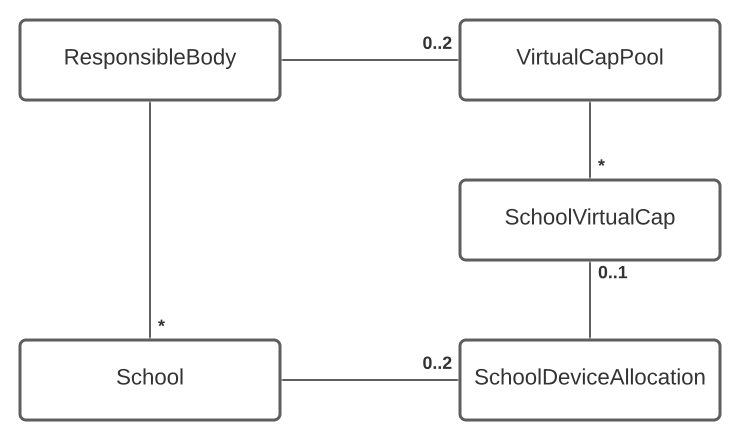
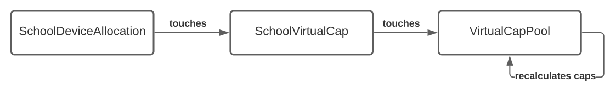
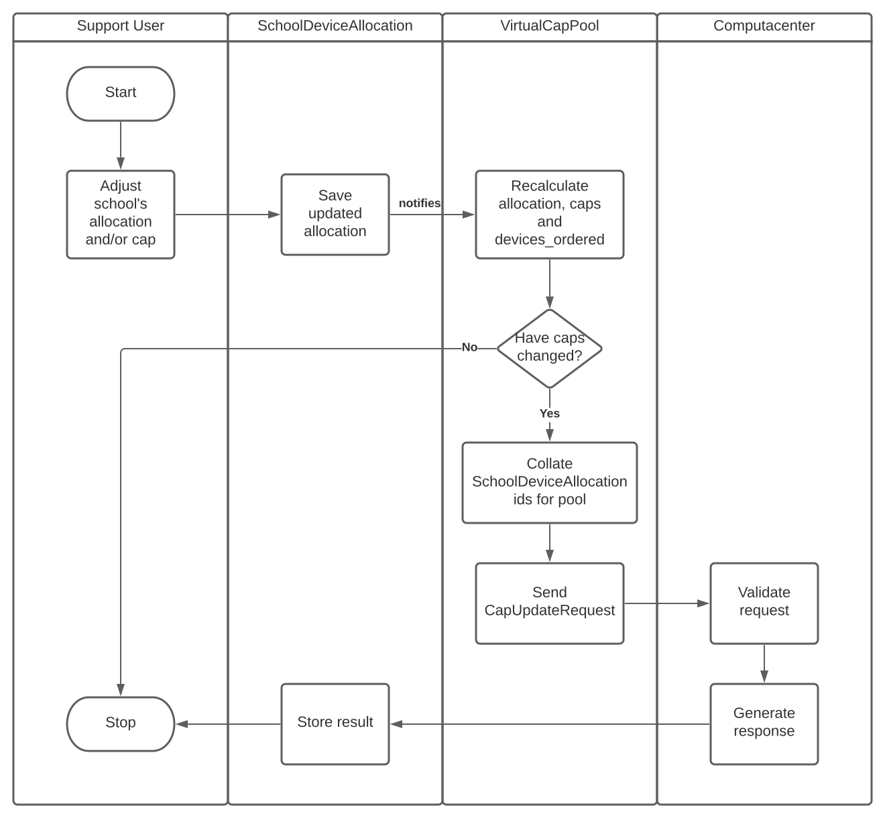

# Virtual Cap Pools

## Overview

Before virtual cap pools were implemented, each school would have a `SchoolDeviceAllocation` for devices and possibly another `SchoolDeviceAllocation` for routers.  The `SchoolDeviceAllocation` contains the `allocation`, `cap` (the amount of their allocation they can currently order) and a `devices_ordered` value indicating how much of the `cap` had been used.

The `cap` values are sent automatically to Computacenter so that they are able to control the amount available for the school to order via Techsource.  The `devices_ordered` values are updated by Computacenter once a school has placed an order.

In Techsource, users can order devices only for schools they are associated with. When devices have been ordered for a school, the devices are delivered to that school's address. This works fine for most schools, especially those devolved schools which are managing their own devices.  However, some responsible bodies that manage their schools centrally needed the abilty to have devices sent to a central location rather than directly to individual schools. Typically this was to facilitate the installation, configuration and distribution of the devices from a centralised IT office.

The solution to this for centrally managed schools was to provide a virtual cap pool as means to group together device and/or router allocations within a responsible body and enable the full amount available to be ordered for, and therefore delivered to, any of the organisation's schools.

## Implementation



The virtual cap pool implementation add two models to the schema, `VirtualCapPool` and `SchoolVirtualCap`.

A `ResponsibleBody` can have one `VirtualCapPool` per device type. Currently we have two types, 'device' and 'coms' representing laptop/tablet devices and routers respectively.

The `SchoolVirtualCap` is a join table between a `SchoolDeviceAllocation` of a given type and the `VirtualCapPool` of the same type.

Additionally, each `ResponsibleBody` instance has an attribute that determines whether or not the virtual cap pool functionality is enabled.  This attribute is a boolean value named `vcap_feature_flag`.  When this flag is set, the `allocation`, `cap` and `devices_ordered` values for the responsible body's centrally managed schools are taken from the virtual cap pool rather than the school.

### Raw values

Once in a virtual pool, the accessors for `allocation`, `cap` and `devices_ordered` for a `SchoolDeviceAllocation`  retrieve their values from the associated `VirtualCapPool`. To enable the original values to be exposed in the service UI, additional accessor methods have been added that retrieve the local values for a given instance. The accessors are all prefixed with `raw_` - `raw_allocation`, `raw_cap` and `raw_devices_ordered`.

### Adjusted cap

The `cap` value passed to Computacenter for a school in a virtual cap pool needs to be adjusted based on how many devices have already been ordered.  This is to ensure that the full amount of devices available to order could be ordered for any school in the pool.

e.g.

A virtual cap pool has 20 devices in total available to order. Only one school in the pool has placed orders and it has ordered 10 devices. The cap updates sent to Computcenter would have a `cap` value of `20` for all the schools that haven't ordered and a `cap` value of `30` for the school that has already ordered (20 + 10 already ordered).  This enables the full amount of `20` devices to be ordered from any school. Computacenter track how many have been ordered and will perform the calculation:

> cap - devices already ordered = amount available to order

so we need to adjust the `cap` to add the amount already ordered.

The cap adjustment is performed in the `SchoolVirtualCap#adjusted_cap` method

### Notification of changes

Changes to the `allocation` and `cap` values of a `SchoolDeviceAllocation` need to be propagated up to the `VirtualCapPool`. This is done using `touch: true` on the model associations and the `after_touch` `ActiveRecord::Callbacks` framework.



### Cap updates to Computacenter

Before virtual cap pools, cap update requests were only sent to Computacenter when a school's order state was changed via the `UpdateSchoolDevicesService`. 

With virtual cap pools and the shared caps, we must also generate cap update requests whenever the cap amount of the pool changes. The change must be sent to Computacenter for all schools in that pool.



### Adding a school to a pool

#### Prerequisites

`ResponsibleBody` _must_

* Have `vcap_feature_flag` set to `true`

`School` _must_

* Be centrally managed - `school.orders_managed_centrally?` returns `true`
* Belong to the same responsible body as the `VirtualCapPool`
* Have at least 1 device allocation record
* Not already be in the `VirtualCapPool`

#### Automatically adding schools

Schools are normally automatically added to a virtual pool when they are enabled for ordering and the above prerequisites are in place.  This takes place via the `UpdateSchoolDevicesService#update!` method used to change the school's order state.

#### Manually add a school

Sometimes it may be necessary to add schools to a pool outside of this process.

1. Ensure the prerequisites above are in place
2. Add the school to the responsible body's virtual pools

```ruby
rb.add_school_to_virtual_cap_pools!(school)
```

This will add the school's device allocations to the appropriate virtual pools

3. Check that the school's preorder status looks correct,  it may be necessary to force the preorder status to refresh:

```ruby
school.refresh_device_ordering_status!
```

4. Check that the virtual pool information looks correct, if necessary force a recalculation:

```ruby
rb.calculate_virtual_caps!
=> [#<VirtualCapPool:0x0000564a34d8fef8
  id: 974,
  device_type: "coms_device",
  responsible_body_id: 2777,
  cap: 0,
  devices_ordered: 0,
  created_at: Tue, 24 Nov 2020 11:33:01.114249000 GMT +00:00,
  updated_at: Thu, 07 Jan 2021 13:28:20.375824000 GMT +00:00,
  allocation: 0>,
 #<VirtualCapPool:0x0000564a34d8fc50
  id: 975,
  device_type: "std_device",
  responsible_body_id: 2777,
  cap: 1172,
  devices_ordered: 1207,
  created_at: Tue, 24 Nov 2020 11:33:01.155062000 GMT +00:00,
  updated_at: Thu, 07 Jan 2021 13:28:20.432806000 GMT +00:00,
  allocation: 1213>]
```

5. You can also verify that a cap update has been sent to Computacenter for the school from the `cap_update_request_timestamp`

```ruby
school.std_device_allocation
=> #<SchoolDeviceAllocation:0x0000564a36cdd670
 id: 20915,
 school_id: 20979,
 device_type: "std_device",
 allocation: 74,
 devices_ordered: 15,
 created_at: Thu, 27 Aug 2020 13:03:26.814923000 BST +01:00,
 updated_at: Thu, 07 Jan 2021 13:28:20.807274000 GMT +00:00,
 last_updated_by_user_id: nil,
 created_by_user_id: nil,
 cap: 74,
 cap_update_request_timestamp: Thu, 07 Jan 2021 13:28:20.440683000 GMT +00:00,
 cap_update_request_payload_id: "2173f28f-c6be-4a46-87ff-d29de6033a9d">
```
